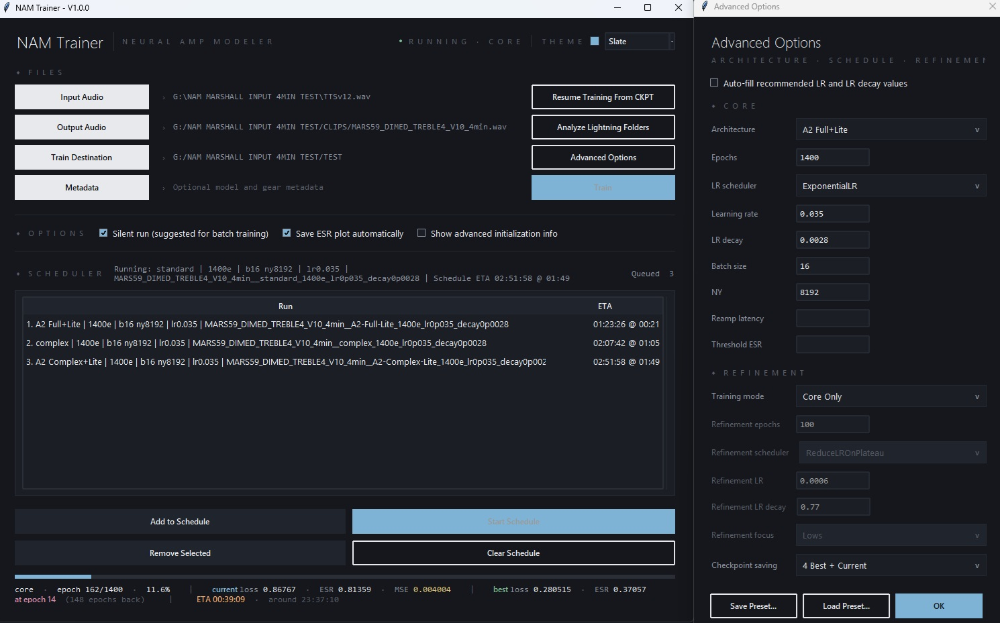

# Release Checklist

Use this checklist before publishing NAM Trainer Reloaded.

## Verify The Package

Windows:

```bat
INSTALL_WINDOWS.bat
run_trainer.bat
```

macOS:

```sh
sh INSTALL_MACOS.sh
sh run_trainer.sh
```

## Confirm Exclusions

Before committing, confirm the repository does not contain:

- `settings.json`
- saved advanced-option preset data
- `.ckpt` files
- `.nam` files
- output WAV clips
- input WAV clips, except the required internal `nam/models/_resources/loudness_input.wav`
- `lightning_logs`
- `__pycache__`
- `.conda-env` or `.venv`

## Suggested Release Notes

NAM Trainer Reloaded v0.1.0



Highlights:

- Local desktop trainer based on Neural Amp Modeler training code.
- A2 architecture support, including current packed A2 variants.
- Resume-from-checkpoint support, including A2 checkpoint pairs.
- Current custom architecture list.
- TTS input v11 short registered as a known v3-compatible input clip.
- DeviceStatsMonitor disabled by default.
- Windows local install/run scripts.
- macOS install/run shell scripts and `.command` launchers.
- No user presets, captures, output clips, checkpoints, or training logs included.

Installation:

- Windows: run `INSTALL_WINDOWS.bat`, then `run_trainer.bat`.
- Windows CPU only: run `INSTALL_WINDOWS.bat -CPU`.
- macOS: run or double-click `INSTALL_MACOS.command`, then `run_trainer.command`.

See `INSTALL.md` for detailed CPU/GPU dependency notes.
